# precrime

[](https://github.com/smkwray/precrime/actions/workflows/ci.yml)

A reproducible research prototype for multi-horizon rearrest prediction, with calibrated probability outputs and subgroup fairness diagnostics. Primary analysis uses the NIJ Georgia parole dataset, with additional analyses on COMPAS (Broward County) and NCRP (national corrections data). Labels are rearrest or reincarceration outcome labels (often used as proxies for recidivism). This is a research pipeline — not validated for operational use.

## Start here

- **Overview:** [Key Findings](#key-findings) + [Limitations](#limitations)
- **Full report:** [`docs/REPORT.md`](docs/REPORT.md) — paper-style narrative with methodology and results
- **Metric definitions:** [`docs/EXPLAINER.md`](docs/EXPLAINER.md) — plain-language guide to Brier, AUROC, FPR, etc.
- **Deep dive:** [`reports/fairness_report.md`](reports/fairness_report.md), [`reports/operational_eval.md`](reports/operational_eval.md), [`reports/final_summary.md`](reports/final_summary.md)
- **Individual analysis:** [`reports/individual_analysis.md`](reports/individual_analysis.md) — lowest predicted, worst errors, trait profiles

### Visual quick look

Figures are generated from aggregate report data (no row-level data).

<table>
  <tr>
    <td>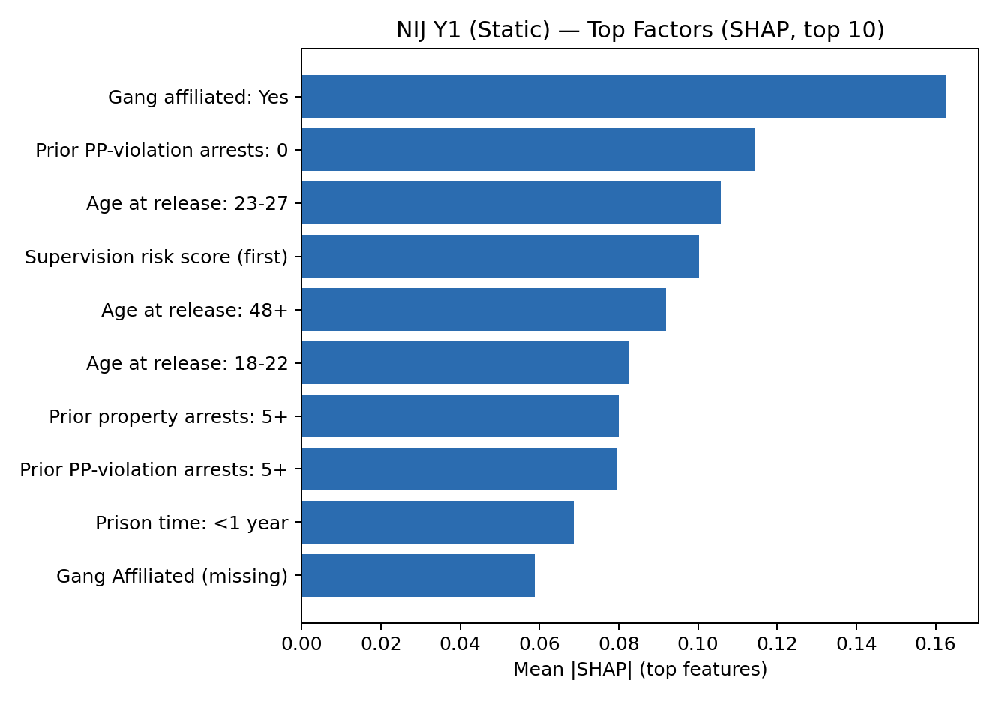</td>
    <td>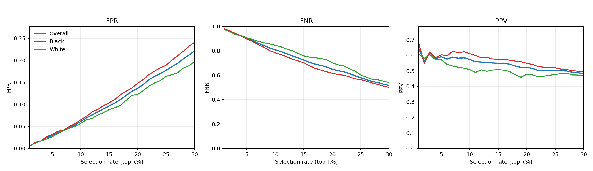</td>
  </tr>
  <tr>
    <td>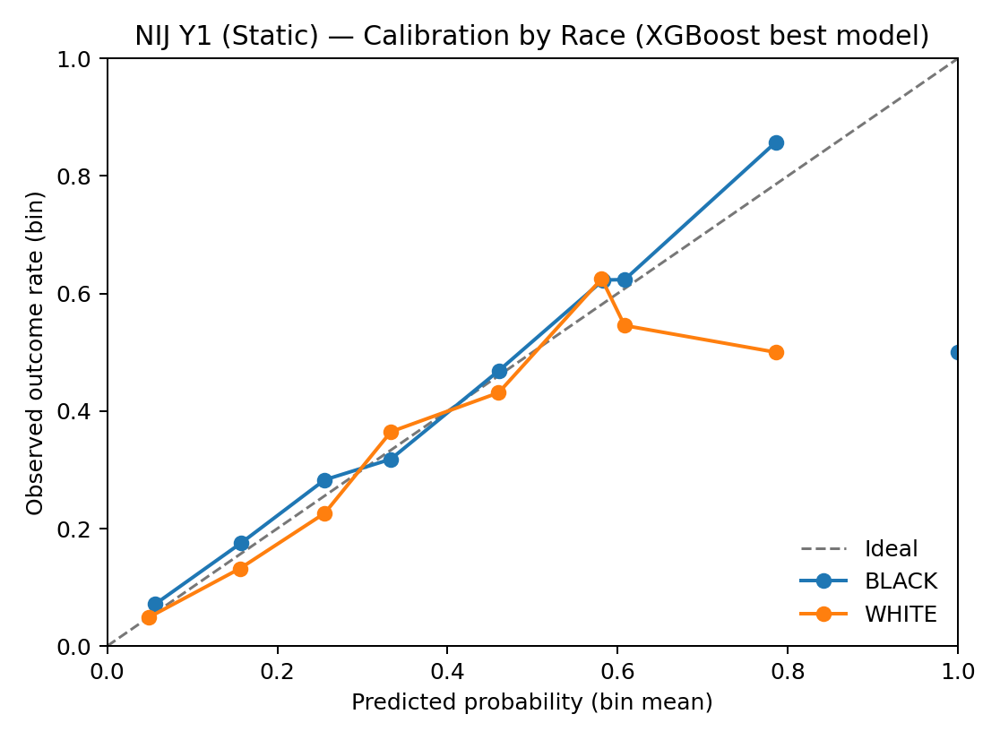</td>
    <td>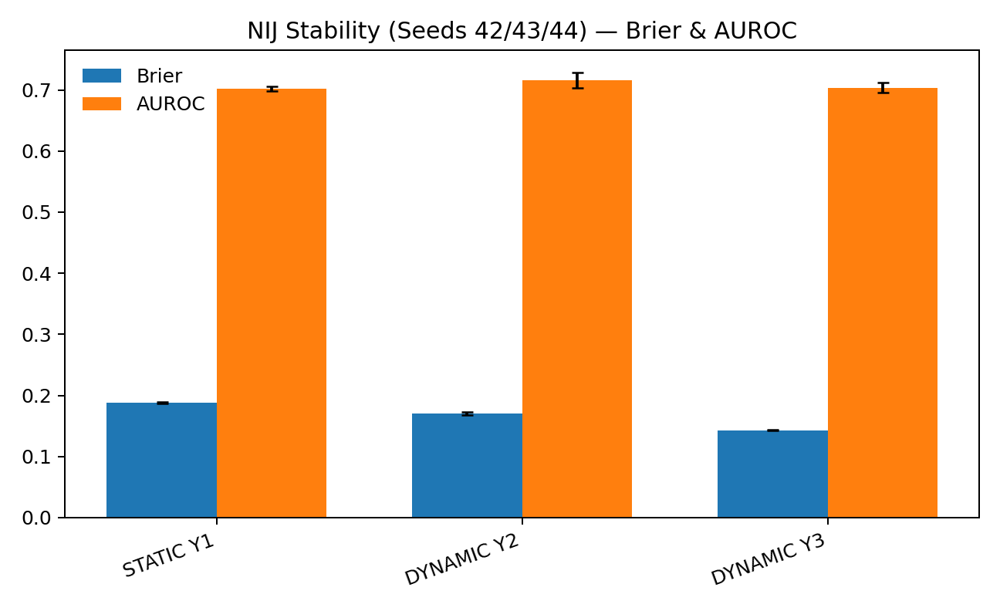</td>
  </tr>
</table>

---

## Key Findings

All numbers below are from the NIJ Georgia parole cohort (≈18,000 individuals) using seeded evaluation splits (seed 42). These are **associations in the data, not causal claims**. Rearrest is an observable event in the justice system, not a comprehensive measure of behavior.

### Top predictive factors

The features with the largest influence on model predictions (by SHAP value, Year 1 static model):

| Rank | Factor | Mean \|SHAP\| |
|---:|---|---:|
| 1 | Gang affiliation indicator | 0.163 |
| 2 | No prior violation-arrest episodes | 0.114 |
| 3 | Age at release: 23–27 | 0.106 |
| 4 | Supervision risk score | 0.100 |
| 5 | Age at release: 48+ | 0.092 |
| 6 | Age at release: 18–22 | 0.082 |
| 7 | Prior property-arrest episodes: 5+ | 0.080 |
| 8 | Prior violation-arrest episodes: 5+ | 0.080 |
| 9 | Prison duration: < 1 year | 0.069 |
| 10 | Mental health / substance abuse condition | 0.050 |

Full rankings for all horizons: [`reports/nij_predictive_factors.md`](reports/nij_predictive_factors.md).

### Unadjusted rearrest rates by key risk factors

These are raw observed rates — not adjusted for other variables. Y2/Y3 are conditional (only individuals not rearrested in prior horizons). Base rates: Y1 = 29.8%, Y2 = 25.7%, Y3 = 19.1%.

| Factor | Y1 Δ pp | Y2 Δ pp | Y3 Δ pp |
|---|---:|---:|---:|
| Gang affiliated | +17.1 | +15.5 | +13.1 |
| Age 18–22 | +12.2 | +9.4 | +6.4 |
| Age 48+ | −10.9 | −8.8 | −6.2 |
| Prior property arrests: 5+ | +9.2 | +7.2 | +5.6 |
| Supervision risk 7–10 | +6.3 | +5.9 | +4.4 |
| Prison < 1 year | +5.0 | +4.6 | +2.1 |
| MH/SA condition | +2.7 | +2.5 | +1.8 |

"Δ pp" = percentage-point change in rearrest rate relative to the base rate for that horizon. Ordered by Y1 absolute difference. Full breakdowns: [`reports/nij_predictive_factors.md`](reports/nij_predictive_factors.md).

### Lowest-likelihood traits (protective factors)

Traits associated with the **lowest observed rearrest rates** across all three datasets. These are unadjusted (raw subgroup rates), not causal claims.

| Dataset | Base Rate | Lowest-Rate Trait | Observed Rate | Δ from Base |
|---|---:|---|---:|---:|
| NIJ (Y1) | 29.8% | Age 48+ | 18.9% | −10.9 pp |
| COMPAS | 45.5% | 0 prior offenses | 28.6% | −16.9 pp |
| NCRP (Y1) | 29.5% | Time served 5+ years | 10.9% | −18.6 pp |

<details>
<summary><strong>Show NIJ lowest-rearrest traits (Georgia Parole, Year 1)</strong></summary>

Base rate: 29.8%. Traits ranked by how far below the base rate they fall.

| Rank | Trait | N | Rate | Δ (pp) | Relative Risk |
|---:|---|---:|---:|---:|---:|
| 1 | Age 48 or older | 2,641 | 18.9% | −10.9 | 0.63 |
| 2 | Supervision risk score 1–3 | 2,806 | 19.1% | −10.7 | 0.64 |
| 3 | 0 prior property arrests | 4,561 | 20.0% | −9.8 | 0.67 |
| 4 | Gang affiliation unknown | 2,217 | 20.6% | −9.2 | 0.69 |
| 5 | Prison time >3 years | 3,842 | 21.7% | −8.1 | 0.73 |
| 6 | No MH/SA condition | 6,187 | 24.7% | −5.1 | 0.83 |
| 7 | Age 43–47 | 1,858 | 24.8% | −5.0 | 0.83 |
| 8 | Age 38–42 | 2,040 | 26.2% | −3.6 | 0.88 |
| 9 | No gang affiliation | 13,030 | 27.8% | −2.0 | 0.93 |
| 10 | Prison time 2–3 years | 2,935 | 28.1% | −1.7 | 0.94 |

**Composite low-risk profile:** Older (43+), low supervision risk (1–3), no prior property arrests, longer prison terms (>3 years), no gang affiliation.

</details>

<details>
<summary><strong>Show COMPAS lowest-rearrest traits (Broward County, 2-year)</strong></summary>

Base rate: 45.5%. Traits ranked by how far below the base rate they fall.

| Rank | Trait | N | Rate | Δ (pp) | Relative Risk |
|---:|---|---:|---:|---:|---:|
| 1 | Asian | 31 | 25.8% | −19.7 | 0.57 |
| 2 | COMPAS score 1–3 (low) | 2,755 | 28.5% | −17.0 | 0.63 |
| 3 | 0 prior offenses | 2,085 | 28.6% | −16.9 | 0.63 |
| 4 | COMPAS risk level: Low | 3,421 | 31.5% | −14.0 | 0.69 |
| 5 | Age >45 | 1,293 | 32.0% | −13.5 | 0.70 |
| 6 | Violence score 1–3 (low) | 3,432 | 33.9% | −11.6 | 0.75 |
| 7 | Female | 1,175 | 35.1% | −10.4 | 0.77 |
| 8 | Other race | 343 | 36.2% | −9.3 | 0.80 |
| 9 | Hispanic | 509 | 37.1% | −8.4 | 0.82 |
| 10 | Misdemeanor charge | 2,202 | 37.5% | −8.0 | 0.82 |

**Composite low-risk profile:** Older (>45), zero prior offenses, low COMPAS scores, female, misdemeanor charge. *Asian subgroup (N=31) too small for reliable estimation.*

</details>

<details>
<summary><strong>Show NCRP lowest-reincarceration traits (national corrections, Year 1)</strong></summary>

Base rate: 29.5%. Label is return-to-prison (not rearrest). Traits ranked by how far below the base rate they fall.

| Rank | Trait | N | Rate | Δ (pp) | Relative Risk |
|---:|---|---:|---:|---:|---:|
| 1 | Time served 5+ years | 1,340 | 10.9% | −18.6 | 0.37 |
| 2 | Sentence 25+ years / life | 414 | 12.1% | −17.4 | 0.41 |
| 3 | Unconditional release (max-out) | 14,298 | 13.9% | −15.6 | 0.47 |
| 4 | Age 55+ | 2,629 | 15.9% | −13.6 | 0.54 |
| 5 | Time served 2–5 years | 2,985 | 16.0% | −13.5 | 0.54 |
| 6 | Sentence 10–25 years | 1,156 | 20.4% | −9.1 | 0.69 |
| 7 | New court commitment | 39,091 | 21.7% | −7.8 | 0.74 |
| 8 | Time served 1–2 years | 9,852 | 21.2% | −8.3 | 0.72 |
| 9 | Race unknown | 5,439 | 22.2% | −7.3 | 0.75 |
| 10 | Female | 6,945 | 24.0% | −5.5 | 0.81 |

**Composite low-risk profile:** Longer time served (2+ years), unconditional release, older (55+), new court commitment (not parole revocation).

</details>

<details>
<summary><strong>Show cross-dataset protective patterns</strong></summary>

Traits consistently associated with **lower** rearrest/reincarceration across all three datasets:

| Pattern | NIJ | COMPAS | NCRP |
|---|---|---|---|
| **Older age** | 48+: 18.9% (base 29.8%) | >45: 32.0% (base 45.5%) | 55+: 15.9% (base 29.5%) |
| **Female sex** | — | 35.1% (base 45.5%) | 24.0% (base 29.5%) |
| **Fewer/zero priors** | 0 property arrests: 20.0% | 0 priors: 28.6% | New commitment: 21.7% |
| **Longer incarceration** | >3 yr: 21.7% | — | 5+ yr: 10.9% |
| **Lower risk scores** | Risk 1–3: 19.1% | COMPAS 1–3: 28.5% | — |

| Factor | Datasets Present | Consistency |
|---|---:|---|
| Older age (top quintile) | 3/3 | Strong |
| Zero / minimal prior record | 3/3 | Strong |
| Lower risk classification | 2/3 | Moderate |
| Longer time served | 2/3 | Moderate |
| Female sex | 2/3 | Moderate |

Full analysis: [`reports/lowest_rearrest_traits.md`](reports/lowest_rearrest_traits.md).

</details>

<details>
<summary><strong>Show individual prediction analysis (lowest predicted + worst model errors)</strong></summary>

From the held-out test set (20% split, seed 42). Full trait profiles: [`reports/individual_analysis.md`](reports/individual_analysis.md).

**Lowest-predicted individuals (closest to 0):**

| Dataset | Bottom 5% Cutoff | N | Actual Rate | Pred Mean | Pred Min |
|---|---:|---:|---:|---:|---:|
| NIJ Y1 | p ≤ 0.081 | 181 | 5.5% | 0.064 | 0.026 |
| NIJ Y1 (bottom 1%) | p ≤ 0.054 | 37 | **0.0%** | 0.044 | 0.026 |
| COMPAS | p ≤ 0.117 | 62 | 12.9% | 0.101 | 0.063 |
| NCRP Y1 | p ≤ 0.059 | 715 | 2.5% | 0.031 | 0.000 |

NIJ bottom-1% profile: 60% age 48+, 100% no gang affiliation, 68% prison >3yr, 67% sex offense, 81% white, 78% zero property arrests. **None were rearrested.**

COMPAS bottom-5% profile: 58% age >45, 55% female, 95% zero priors, 100% low COMPAS score, 61% misdemeanor.

NCRP bottom-5% profile: 100% age <25, 85% new court commitment, 43% unconditional release. *Note: unlike NIJ/COMPAS where older age is protective, NCRP's lowest-predicted group is young — this reflects the grouped-split design and the interaction between age, release type, and admission type in the NCRP data, not a contradiction of the age pattern.*

**Worst false negatives** (rearrested but model predicted low):

| Dataset | N | Pred Mean | Pred Max | Key Pattern |
|---|---:|---:|---:|---|
| NIJ Y1 | 53 | 0.106 | 0.143 | 30% age 48+, 100% no gang, 62% zero property arrests — look like low-risk but reoffended |
| COMPAS | 28 | 0.129 | 0.167 | 100% low COMPAS score, 79% zero priors, 46% age >45 — classic low-risk profile |
| NCRP Y1 | 181 | 0.105 | 0.130 | 100% age <25, 76% new commitment, 62% unconditional release |

**Worst false positives** (not rearrested but model predicted high):

| Dataset | N | Pred Mean | Pred Min | Key Pattern |
|---|---:|---:|---:|---|
| NIJ Y1 | 126 | 0.569 | 0.507 | 71% gang-affiliated, 100% male, 84% age <33, 45% prison <1yr, 39% 5+ property arrests |
| COMPAS | 33 | 0.781 | 0.659 | 79% African-American, 94% male, 85% felony, 91% medium/high COMPAS score |
| NCRP Y1 | 424 | 0.697 | 0.635 | 95% male, parole-revocation admissions, property offenses |

</details>

<details>
<summary><strong>Show COMPAS predictive factors and unadjusted rates (Broward County, 2-year rearrest)</strong></summary>

Different dataset, population, and features than NIJ — not directly comparable. These are associations, not causal effects. Base rate: 45.5%.

**Top SHAP factors:**

| Rank | Factor | Mean \|SHAP\| |
|---:|---|---:|
| 1 | Prior violent recidivism indicator | 0.596 |
| 2 | Prior offense count | 0.542 |
| 3 | Age | 0.380 |
| 4 | COMPAS decile score | 0.272 |
| 5 | Charge: arrest case no charge | 0.082 |
| 6 | Sex: female | 0.079 |
| 7 | COMPAS violence decile score | 0.076 |
| 8 | Charge: possession of cocaine | 0.073 |
| 9 | Days between screening and arrest | 0.071 |
| 10 | Charge degree: felony | 0.059 |

**Unadjusted rearrest rates (Δ pp from base rate 45.5%):**

| Factor | Δ pp |
|---|---:|
| Prior violent recidivism | +48.7 |
| Prior offenses: 11+ | +30.3 |
| COMPAS score: high (7–10) | +24.3 |
| Prior offenses: 0 | −16.9 |
| Age > 45 | −13.5 |
| Age < 25 | +10.5 |
| Charge degree: felony | +4.5 |
| Sex: male | +2.4 |

Full breakdowns: [`reports/compas_predictive_factors.md`](reports/compas_predictive_factors.md). Benchmark: [`reports/compas_benchmark.md`](reports/compas_benchmark.md).

</details>

<details>
<summary><strong>Show NCRP predictive factors and unadjusted rates (national corrections, reincarceration)</strong></summary>

Different dataset and label (return-to-prison, not rearrest) — not directly comparable to NIJ. Base rates: Y1 = 29.5%, Y2 = 10.2%, Y3 = 5.5%.

**Top SHAP factors (Y1):**

| Rank | Factor | Mean \|SHAP\| |
|---:|---|---:|
| 1 | Release year | 0.308 |
| 2 | Release type: unconditional (sentence expiry) | 0.308 |
| 3 | Admission type: parole revocation/return | 0.231 |
| 4 | State (California) | 0.213 |
| 5 | Time served (months) | 0.168 |
| 6 | Offense category: property | 0.112 |
| 7 | Admission year | 0.087 |
| 8 | Race: Hispanic | 0.075 |
| 9 | Age at release | 0.073 |
| 10 | Sex: female | 0.068 |

**Unadjusted reincarceration rates by key factors:**

| Factor | Y1 Δ pp | Y2 Δ pp | Y3 Δ pp |
|---|---:|---:|---:|
| Time served: 5+ years | −18.6 | −5.4 | −3.1 |
| Parole revocation admission | +16.7 | +3.5 | +0.8 |
| Unconditional release (max-out) | −15.6 | −1.5 | +0.1 |
| Age 55+ | −13.6 | −6.4 | −3.7 |
| Time served: < 6 months | +5.7 | +0.7 | +0.5 |
| Property offense | +5.0 | +2.2 | +0.9 |
| Age 18–24 | +3.6 | +3.8 | +1.9 |

Full breakdowns: [`reports/ncrp_37973_predictive_factors.md`](reports/ncrp_37973_predictive_factors.md). Benchmark: [`reports/ncrp_37973_terms_benchmark.md`](reports/ncrp_37973_terms_benchmark.md).

</details>

### Model performance

**Metric quick defs:** **Brier** = probability error (lower is better). **AUROC** = ranking quality (higher is better). See [`docs/EXPLAINER.md`](docs/EXPLAINER.md).

| Horizon | Calibration | Brier | AUROC | AUPRC | ECE |
|---|---|---:|---:|---:|---:|
| Year 1 (static) | Platt | 0.18758 | 0.70164 | 0.47910 | 0.00746 |
| Year 2 (dynamic) | isotonic | 0.17244 | 0.70475 | 0.42645 | 0.01715 |
| Year 3 (dynamic) | isotonic | 0.14324 | 0.69594 | 0.31555 | 0.01232 |

A Brier score of 0.188 (best Year 1 result) means predicted probabilities are, on average, about 0.19 squared-probability-units from the actual 0/1 outcomes. For context, always predicting the base rate gives Brier ≈ 0.209. The improvement is real but modest — this is a difficult prediction problem. Lasso-logistic baselines achieve 0.188 / 0.178 / 0.148 for Y1/Y2/Y3, so XGBoost's gains are most noticeable at longer horizons where dynamic features add value.

<details>
<summary><strong>Show model sweep and NIJ-style scoring details</strong></summary>

Best models by NIJ-style accuracy (sex-average Brier; lower is better) from `reports/model_sweep.md`:
- **Y1:** `logistic_gd (platt)` — bs_sex_avg = 0.16754
- **Y2:** `xgb_best (isotonic)` — bs_sex_avg = 0.16173
- **Y3:** `hist_gb (isotonic)` — bs_sex_avg = 0.12640 (with `xgb_best` close at 0.12675)

Sex-disaggregated Brier for the NIJ-style scoring view (best XGBoost configs; "with_race" variant) from `reports/nij_scoring.md`:
- **Y1:** F = 0.14326, M = 0.19331
- **Y2:** F = 0.14579, M = 0.17767
- **Y3:** F = 0.10322, M = 0.15028

</details>

### Fairness diagnostics

Subgroup metrics are computed by race (Black/White), gender (M/F), and age group, both with and without race as a training feature.

**Year 1, static, Platt-calibrated XGBoost — subgroup accuracy:**

| Subgroup | Group | N | Brier | AUROC |
|---|---|---:|---:|---:|
| Race | BLACK | 2,045 | 0.195 | 0.692 |
| Race | WHITE | 1,561 | 0.177 | 0.713 |
| Gender | M | 3,178 | 0.193 | 0.697 |
| Gender | F | 428 | 0.144 | 0.670 |

At an illustrative threshold of 0.5 (not recommended for any operational use):
- **Race (Black vs. White):** FPR gap = 0.002, FNR gap = 0.063 (with race as a feature). Excluding race from training narrows some gaps slightly but does not eliminate them.
- **Gender (M vs. F):** Larger gaps (FPR gap = 0.063, FNR gap = 0.172), partly driven by low female base rates producing unstable estimates.
- **Age:** The 18–22 group has substantially higher selection rates and different error profiles than older groups.

All fairness metrics depend on the classification threshold chosen; there is no single "fair" threshold. Full subgroup tables with bootstrap CIs: [`reports/fairness_report.md`](reports/fairness_report.md).

<details>
<summary><strong>Show error-rate tables and threshold analysis</strong></summary>

**NIJ Y1 Static: Errors at t=0.5 (illustrative)**

| Subgroup | Group | FP | FN | FPR | FNR | PPV | Sel. rate |
|---|---|---:|---:|---:|---:|---:|---:|
| Race | BLACK | 77 | 523 | 0.055 | 0.803 | 0.624 | 0.100 |
| Race | WHITE | 60 | 368 | 0.053 | 0.866 | 0.487 | 0.075 |
| Gender | M | 137 | 812 | 0.063 | 0.815 | 0.573 | 0.101 |
| Gender | F | 0 | 79 | 0.000 | 0.988 | 1.000 | 0.002 |

**Operational thresholds — why FP/FN depends on policy**

A "top 10%" policy (flag highest-risk 10%) on the same model and split:

| Group | N | FP | FN | FPR | FNR | PPV | Sel. rate |
|---|---:|---:|---:|---:|---:|---:|---:|
| BLACK | 2,045 | 84 | 509 | 0.060 | 0.782 | 0.628 | 0.100 |
| WHITE | 1,561 | 68 | 358 | 0.060 | 0.842 | 0.496 | 0.075 |

Changing the policy changes both burden and misses:
- At `t=0.5`: selection is 8.8%, fewer FPs but more missed positives (higher FNR).
- At `top20%`: selection rises to 20.0%, FNs drop, but FPR rises substantially.
- At `FPR<=0.06`: threshold is tuned to cap overall FPR near 6%.

Thresholding is a policy decision, not a technical default. See [`reports/operational_eval.md`](reports/operational_eval.md).

</details>

<details>
<summary><strong>Show seed stability results</strong></summary>

Best configs rerun on seeds 42, 43, 44 — mean ± std (`reports/stability_eval.md`):

- **STATIC Y1:** Brier 0.18764 ± 0.00111, AUROC 0.70193 ± 0.00363, race FPR gap@top10% 0.00715 ± 0.00638
- **DYNAMIC Y2:** Brier 0.17028 ± 0.00270, AUROC 0.71549 ± 0.01278, race FPR gap@top10% 0.01696 ± 0.01752
- **DYNAMIC Y3:** Brier 0.14280 ± 0.00046, AUROC 0.70392 ± 0.00796, race FPR gap@top10% 0.03198 ± 0.01003

Overall ranking/calibration metrics are fairly stable across seeds. Subgroup gap estimates vary more and should be treated as uncertainty-aware diagnostics, not single fixed values.

</details>

---

## Background

The National Institute of Justice (NIJ) Recidivism Forecasting Challenge asked participants to predict rearrest outcomes at one-, two-, and three-year horizons for a Georgia parole cohort. Most challenge entries focused on classification accuracy, but probability *calibration* — whether a predicted 30% really means 30% of similar individuals are rearrested — matters just as much for any downstream interpretation. This pipeline treats Brier score (a calibration-sensitive proper scoring rule) as the primary metric, evaluates multiple calibration strategies, and runs subgroup fairness diagnostics across race, gender, and age.

<details>
<summary><strong>Show benchmark context (COMPAS, NCRP, NIJ leaderboard)</strong></summary>

### COMPAS benchmark (Broward County)

Source: ProPublica's analysis of COMPAS scores in Broward County, FL. ≈6,200 individuals, two-year rearrest outcome (base rate ≈45.5%). Not directly comparable to NIJ (different jurisdiction, time period, label mechanism). Included as a benchmark case study for the evaluation harness.

Best XGBoost: Brier **0.173**, AUROC **0.808**. Subgroup diagnostics: [`reports/compas_fairness_report.md`](reports/compas_fairness_report.md). Some race subgroups are extremely small, making their metrics unstable.

Details: [`docs/dataset_card_compas.md`](docs/dataset_card_compas.md), [`reports/compas_benchmark.md`](reports/compas_benchmark.md).

### NCRP benchmark (ICPSR 37973)

Source: National Corrections Reporting Program "selected variables" extract. Uses term records to derive a return-to-prison/reincarceration label (not rearrest), with year-granularity event timing.

Best XGBoost Y1: Brier **0.166**, AUROC **0.775**. Subgroup audit: [`reports/ncrp_37973_fairness_report.md`](reports/ncrp_37973_fairness_report.md).

Details: [`docs/datasets/ncrp_icpsr_37973.md`](docs/datasets/ncrp_icpsr_37973.md), [`reports/ncrp_37973_terms_benchmark.md`](reports/ncrp_37973_terms_benchmark.md).

### NIJ Challenge leaderboard context

NIJ scored Challenge submissions on a **held-out test set** (not included in this repo), computing Brier separately for males, females, and their average. This project's numbers are from an internal split of the processed data, so they are **not directly comparable** to the official leaderboard.

NIJ also published a "fair-and-accurate" score combining probability accuracy with a Black/White false-positive-rate parity term at t=0.5. This repo reproduces those terms on the seeded split in `reports/nij_scoring.md`.

| Horizon | Best (Large Team) Avg Brier | Best (Small Team) Avg Brier |
|---|---:|---:|
| Year 1 | 0.1719 | 0.1733 |
| Year 2 | 0.1369 | 0.1450 |
| Year 3 | 0.13048 | 0.13577 |

- NIJ Results: https://nij.ojp.gov/topics/articles/results-national-institute-justice-recidivism-forecasting-challenge
- NIJ Official results: https://nij.ojp.gov/funding/recidivism-forecasting-challenge-results
- NIJ Challenge overview: https://nij.ojp.gov/funding/recidivism-forecasting-challenge

</details>

<details>
<summary><strong>Show methods</strong></summary>

### Task definition (horizons)

The pipeline defines three prediction tasks on the NIJ data, with a leakage-prevention rule:

- **Year 1**: Predict rearrest within 1 year. Full cohort (N ≈ 18,028).
- **Year 2**: Predict rearrest in year 2, *conditioned on no Year 1 rearrest* (N ≈ 12,651).
- **Year 3**: Predict rearrest in year 3, *conditioned on no Year 1 or Year 2 rearrest* (N ≈ 9,398).

This conditioning is critical: Year 2/Year 3 models are trained and evaluated only on individuals not rearrested in prior horizons, avoiding information leakage from future outcomes.

Two feature tracks are maintained: **static-at-release** (available at parole start) and **dynamic-supervision** (includes supervision-activity features released later in the NIJ materials).

### Models

- **Baselines**: Base-rate (constant prediction), naive-demographic (group means), logistic regression, lasso-logistic regression.
- **XGBoost**: Optuna-tuned (32 trials) gradient-boosted trees with three post-hoc calibration variants: raw, Platt scaling, and isotonic regression.

### Evaluation metrics

- **Brier score** (primary): Mean squared error of predicted probabilities. Lower is better. Rewards both discrimination and calibration.
- **AUROC**: Area under the ROC curve. Measures ranking/discrimination ability irrespective of calibration.
- **AUPRC**: Area under the precision-recall curve. More informative than AUROC when classes are imbalanced.
- **ECE**: Expected calibration error. How well predicted probabilities match observed rates across bins.
- **Log loss**: Logarithmic scoring rule. Heavily penalizes confident wrong predictions.

Plain-language guide: [`docs/EXPLAINER.md`](docs/EXPLAINER.md).

</details>

<details>
<summary><strong>Show datasets</strong></summary>

### NIJ Georgia Parole

Source: NIJ Recidivism Forecasting Challenge (Georgia parole cohort). ≈18,000 individuals with ~53 features spanning demographics, criminal history, and supervision context. Three binary targets: rearrest within Year 1, Year 2, and Year 3. See [`docs/dataset_card_nij.md`](docs/dataset_card_nij.md).

### COMPAS (ProPublica)

Source: ProPublica's analysis of COMPAS scores in Broward County, FL. ≈6,200 individuals, two-year rearrest outcome (base rate ≈45.5%). Included as a benchmark case study — not as a ground-truth standard. See [`docs/dataset_card_compas.md`](docs/dataset_card_compas.md).

### NCRP (ICPSR 37973)

Source: NCRP "selected variables" extract. Term records used to derive return-to-prison/reincarceration labels (not rearrest). Year-granularity event timing. See [`docs/datasets/ncrp_icpsr_37973.md`](docs/datasets/ncrp_icpsr_37973.md).

All datasets reflect specific jurisdictions and time periods and should not be assumed to generalize.

</details>

### Figures

Key highlights are shown in **Visual quick look** above. To regenerate: `make figures`.

<details>
<summary><strong>More figures (calibration, SHAP, subgroup gaps, COMPAS)</strong></summary>

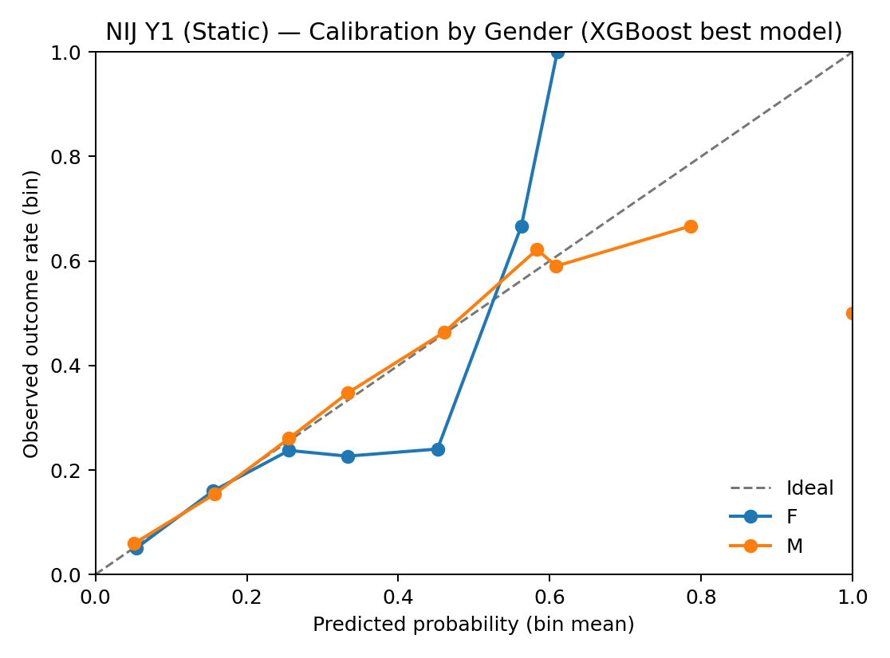

**Calibration by gender (Y1, static, Platt).** The female subgroup has fewer samples, so high-probability bins can be especially noisy; interpret tail behavior cautiously.

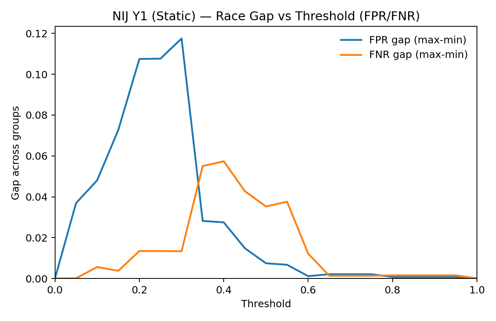

**FPR/FNR gap by race across thresholds (Y1, static).** The disparity in false-positive rate peaks around threshold 0.25–0.30, not at the commonly reported 0.5. A single threshold cannot summarize fairness — the disparity profile changes shape as the threshold moves.

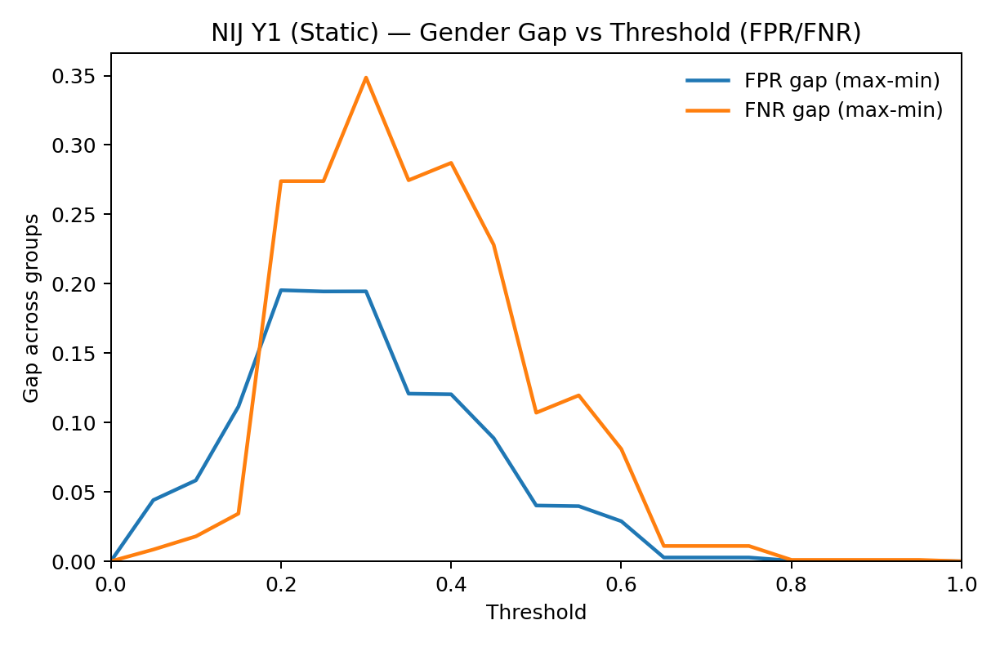

**FPR/FNR gap by gender across thresholds (Y1, static).** Gender gaps can be large across much of the threshold range. Small subgroup sizes can amplify volatility.

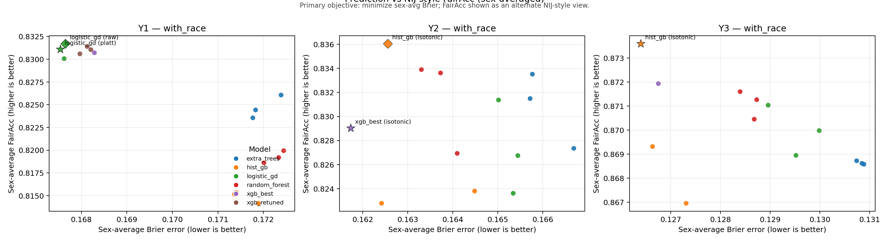

**Model sweep: accuracy vs. fairness tradeoff** across model families and calibration strategies.

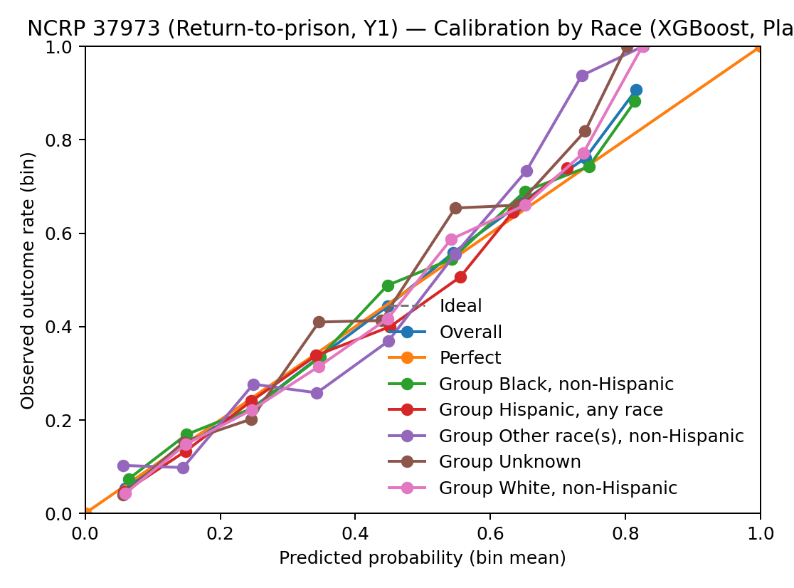

**NCRP benchmark calibration by race** (XGBoost). Different dataset, different label (reincarceration vs. rearrest).

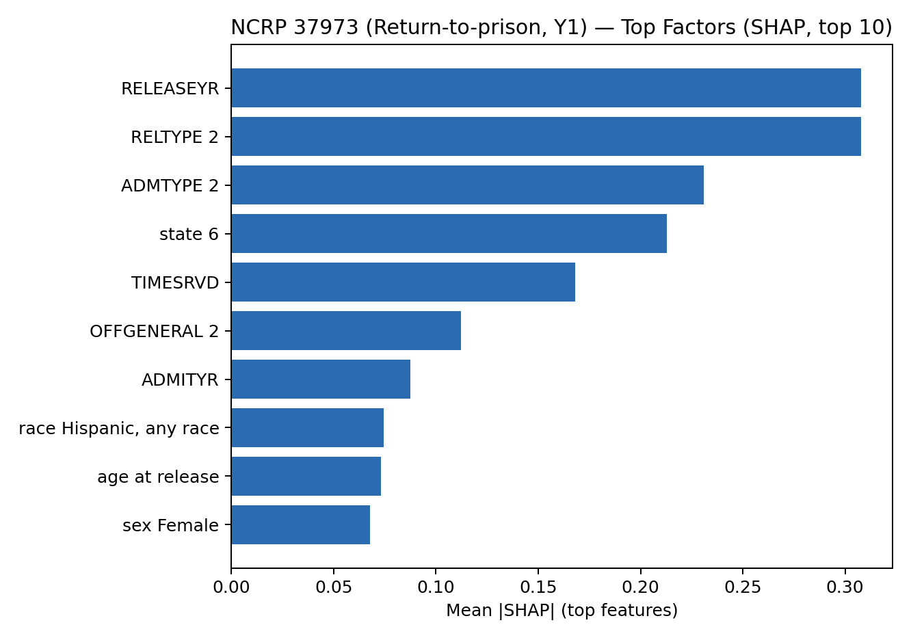

**NCRP top predictive factors (SHAP).** Associations in a separate dataset — not directly comparable to NIJ.

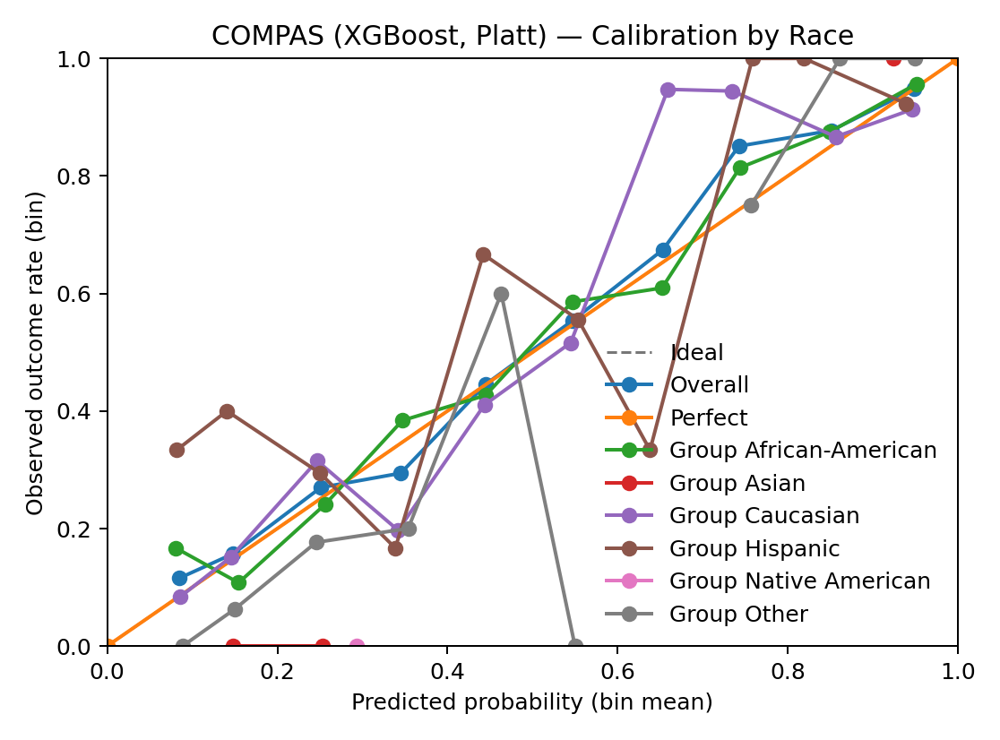

**COMPAS calibration by race** (XGBoost, Platt). Some race subgroups are extremely small, making curves unstable.

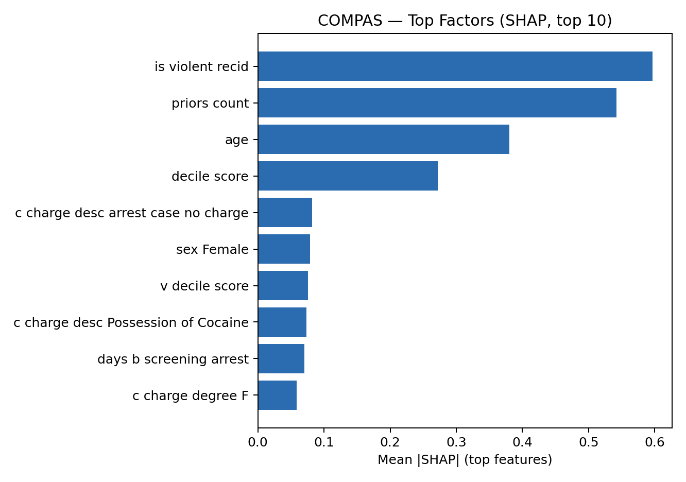

**COMPAS top predictive factors (SHAP).** Not directly comparable to NIJ due to different features and populations.

</details>

## Reproducibility

### Prerequisites

- Python 3.10+
- Datasets must be obtained from their original sources and placed under `data/raw/` (see dataset cards for expected file structure). **Data is not included in this repository** — it contains row-level individual records and is excluded for privacy and governance reasons. See [`docs/PUBLISHING.md`](docs/PUBLISHING.md).

### Setup and run

```bash
# Create a virtual environment (do NOT place inside the repo)
python -m venv ~/venvs/precrime
source ~/venvs/precrime/bin/activate
pip install -r requirements.txt
pip install -r requirements-modeling.txt
pip install -r requirements-viz.txt  # optional (for rendering docs/figures/*.png)

# Run tests
make test

# NIJ pipeline
make nij-baselines
make nij-xgb TRIALS=32

# COMPAS benchmark
make compas TRIALS=32

# Fairness audit
make fairness BOOTSTRAP=2000 BOOTSTRAP_SUBGROUP=200

# Generate static figures (requires reports to exist)
make figures
```

See [`docs/PUBLISHING.md`](docs/PUBLISHING.md) for data-governance guidance.

<details>
<summary><strong>Show all report files</strong></summary>

- NIJ baselines: [`reports/baseline_leaderboard.md`](reports/baseline_leaderboard.md)
- NIJ XGBoost: [`reports/xgb_leaderboard.md`](reports/xgb_leaderboard.md), [`reports/xgb_best_models.json`](reports/xgb_best_models.json)
- NIJ fairness audit: [`reports/fairness_report.md`](reports/fairness_report.md)
- NIJ predictive factors (Y1/Y2/Y3): [`reports/nij_predictive_factors.md`](reports/nij_predictive_factors.md)
- NIJ operational thresholds + FP/FN by race: [`reports/operational_eval.md`](reports/operational_eval.md)
- NIJ stability across seeds: [`reports/stability_eval.md`](reports/stability_eval.md)
- NIJ-style scoring (sex-specific Brier + FairAcc): [`reports/nij_scoring.md`](reports/nij_scoring.md)
- Model-family sweep: [`reports/model_sweep.md`](reports/model_sweep.md)
- Seed-ensemble evaluation: [`reports/ensemble_eval.md`](reports/ensemble_eval.md)
- COMPAS benchmark: [`reports/compas_benchmark.md`](reports/compas_benchmark.md)
- COMPAS fairness: [`reports/compas_fairness_report.md`](reports/compas_fairness_report.md)
- NCRP benchmark: [`reports/ncrp_37973_terms_benchmark.md`](reports/ncrp_37973_terms_benchmark.md)
- NCRP fairness: [`reports/ncrp_37973_fairness_report.md`](reports/ncrp_37973_fairness_report.md)
- Policy curves: [`reports/policy_curves.md`](reports/policy_curves.md)
- Lowest-rearrest traits: [`reports/lowest_rearrest_traits.md`](reports/lowest_rearrest_traits.md)
- Individual prediction analysis: [`reports/individual_analysis.md`](reports/individual_analysis.md)
- Plot specifications (JSON): [`reports/plots/`](reports/plots/)

</details>

## Limitations

- Labels are rearrest outcomes — an observable event in the justice system, not a comprehensive measure of behavior.
- Results come from a single Georgia parole cohort (NIJ) and a Broward County sample (COMPAS). They should not be assumed to generalize.
- XGBoost improvements over logistic regression baselines are real but small (Brier differences of 0.001–0.006).
- Subgroup error-rate gaps persist whether or not race is included as a training feature.
- All fairness metrics depend on the classification threshold chosen; there is no single "fair" threshold.
- This is a research prototype, not validated for operational use.

## License

This project is released under the MIT License. See [`LICENSE`](LICENSE) for details.

## Citation

If you use this code or methodology, please cite:

```
@misc{precrime2026,
  author  = {Wray, Shane},
  title   = {precrime: Calibrated Multi-Horizon Rearrest Prediction (Research Prototype)},
  year    = {2026},
  url     = {https://github.com/smkwray/precrime}
}
```
