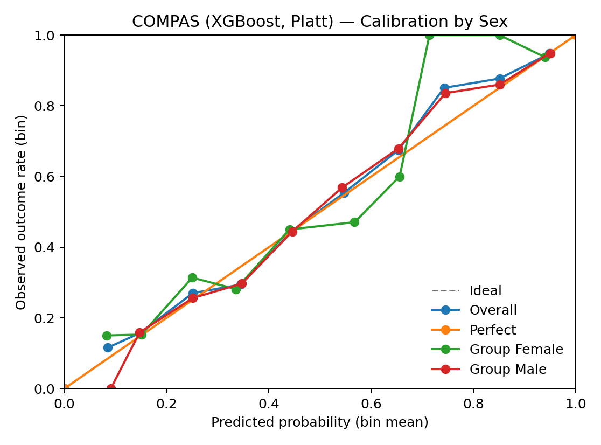

# Calibrated Multi-Horizon Rearrest Prediction

## Abstract

This report describes a modeling and evaluation pipeline for predicting rearrest outcomes at one-, two-, and three-year horizons using the NIJ Georgia parole dataset. The pipeline emphasizes probability calibration (measured primarily by Brier score) over classification accuracy, applies horizon-conditioning rules to prevent information leakage across time periods, and reports subgroup fairness diagnostics by race, gender, and age. The best-performing models (Optuna-tuned XGBoost with post-hoc calibration) achieve Brier scores of 0.187, 0.172, and 0.143 for Years 1, 2, and 3 respectively — modest but consistent improvements over logistic regression baselines. A parallel benchmark on the ProPublica COMPAS dataset (Brier 0.173, AUROC 0.808) validates the evaluation harness on an independent dataset. Fairness diagnostics reveal subgroup disparities in error rates that persist whether or not race is included as a training feature. Not validated for operational use in any justice-system context.

## Background and Motivation

Recidivism prediction tools are widely used in criminal justice contexts, yet they face well-documented concerns around accuracy, calibration, fairness, and the fundamental question of what "recidivism" labels actually measure. The NIJ Recidivism Forecasting Challenge provided a structured dataset for comparing modeling approaches on rearrest outcomes for a Georgia parole cohort.

This project was motivated by three observations. First, most published work on recidivism prediction reports classification metrics (accuracy, F1) that obscure calibration quality — whether a model's 30% prediction really corresponds to a 30% observed rate. Brier score, a proper scoring rule that rewards both discrimination and calibration, is a more informative primary metric for probabilistic predictions. Second, multi-horizon prediction (Year 1, 2, 3) requires careful conditioning to avoid leakage: a Year 3 model trained on individuals who were already rearrested in Year 1 would be learning on an invalid population. Third, subgroup fairness diagnostics should be reported as a standard part of any recidivism modeling exercise, regardless of whether fairness constraints are applied during training.

Throughout this report, prediction targets are **rearrest outcomes** — observed events in the justice system.

## Data

### NIJ Georgia Parole

The NIJ Recidivism Forecasting Challenge dataset contains approximately 18,028 individuals from a Georgia parole cohort, with ~53 features covering demographics (age, race, gender), criminal history (prior arrests by type, prior convictions), supervision context (risk scores, conditions), and prison details (offense type, sentence length). Three binary targets indicate rearrest within Year 1, Year 2, and Year 3.

The pipeline maintains two feature tracks: a **static-at-release** track (information plausibly available at parole start) and a **dynamic-supervision** track (includes supervision-activity features released later in the challenge).

After horizon conditioning, the effective sample sizes are: Year 1: 18,028; Year 2: 12,651 (conditioned on Year 1 = 0); Year 3: 9,398 (conditioned on Year 1 = 0 and Year 2 = 0).

### COMPAS (ProPublica Benchmark)

The ProPublica COMPAS analysis dataset from Broward County, FL serves as a benchmark case study. After standard filtering, 6,172 individuals remain with a two-year rearrest outcome label (base rate ~45.5%). This dataset is included to validate that the evaluation harness generalizes to an independent dataset with different characteristics. NIJ and COMPAS results are **not directly comparable** — they reflect different jurisdictions, time periods, populations, and label-construction processes.

### Known Limitations of Both Datasets

**Measurement bias:** Rearrest is influenced by policing and surveillance intensity. Subgroup differences in rearrest rates may partly reflect differential system contact rather than differential behavior. **Selection bias:** Both datasets reflect specific jurisdictions and time periods (Georgia parole cohort; Broward County pretrial) and should not be assumed to generalize. **Label ambiguity:** Rearrest ≠ reconviction ≠ actual offending. The labels do not capture undetected behavior, nor do they account for charges that are later dismissed.

## Task Definition

### Horizon Conditioning (Leakage Prevention)

The three prediction horizons are defined with strict conditioning rules:

- **Year 1:** Predict whether an individual is rearrested within one year of parole start. Trained and evaluated on the full cohort.
- **Year 2:** Predict whether an individual is rearrested in the second year. Trained and evaluated **only on individuals not rearrested in Year 1** (Year 1 = 0).
- **Year 3:** Predict whether an individual is rearrested in the third year. Trained and evaluated **only on individuals not rearrested in Year 1 or Year 2** (Year 1 = 0 and Year 2 = 0).

This conditioning prevents a common form of leakage: without it, a Year 3 model could learn from the (trivially predictable) outcomes of individuals already rearrested in Year 1, inflating apparent performance. The conditioning also means that Year 2 and Year 3 populations are progressively smaller and represent individuals who survived prior observation windows without rearrest.

## Modeling

### Baselines

Four baseline models establish performance floors: a **base-rate** model (constant prediction equal to the training set mean), a **naive-demographic** model (group-mean predictions by demographic category), **logistic regression**, and **lasso-logistic regression** (L1-regularized). All baselines are fit on the static feature track.

### XGBoost with Calibration

The primary model is XGBoost (gradient-boosted decision trees) with hyperparameters tuned via Optuna (32 trials, Brier score as the objective). The best configuration for each horizon is then evaluated with three calibration strategies: **raw** (uncalibrated XGBoost output), **Platt scaling** (logistic regression on the decision function), and **isotonic regression**. Calibration is fit on a held-out calibration fold to avoid overfitting.

XGBoost models are trained on both static and dynamic feature tracks. The best model per horizon is selected by lowest Brier score across all (dataset × calibration) combinations.

### COMPAS Benchmark

The same model suite (baselines + XGBoost with calibration variants) is applied to the COMPAS two-year sample as a harness-validation exercise.

## Metrics

### Brier Score (Primary)

Brier score is the mean squared error between predicted probabilities and binary outcomes: Brier = (1/N) Σ (p_i − y_i)². It ranges from 0 (perfect) to 1 (worst). Unlike accuracy or F1, Brier rewards both discrimination (ranking positive cases higher) and calibration (predicted probabilities matching observed rates). A model that predicts 0.3 for a group where 30% are rearrested scores better than one that predicts 0.8 for the same group, even if both correctly rank individuals.

### Secondary Metrics

**AUROC** (area under the ROC curve) measures pure ranking ability — how well the model separates positive from negative cases, irrespective of calibration. A score of 0.5 is random; 1.0 is perfect discrimination. **AUPRC** (area under the precision-recall curve) is more informative than AUROC when the positive class is relatively rare, as it focuses on the model's performance in the high-confidence region. **ECE** (expected calibration error) directly measures calibration: it bins predictions and computes the mean absolute difference between predicted and observed rates across bins. **Log loss** is a logarithmic proper scoring rule that heavily penalizes confident wrong predictions.

## Results

### NIJ Baselines

| Horizon | Model | Brier | AUROC | AUPRC | ECE |
|---|---|---:|---:|---:|---:|
| Y1 | lasso-logistic | 0.1880 | 0.699 | 0.480 | 0.007 |
| Y1 | base-rate | 0.2094 | 0.492 | 0.362 | 0.011 |
| Y2 | lasso-logistic | 0.1782 | 0.672 | 0.393 | 0.009 |
| Y2 | base-rate | 0.1910 | 0.499 | 0.332 | 0.002 |
| Y3 | lasso-logistic | 0.1479 | 0.653 | 0.286 | 0.014 |
| Y3 | base-rate | 0.1544 | 0.498 | 0.275 | 0.002 |

Logistic regression baselines already achieve reasonable Brier scores. The gap between the base-rate and lasso-logistic narrows at longer horizons, reflecting lower base rates and increasing prediction difficulty.

### NIJ XGBoost (Best per Horizon)

| Horizon | Dataset | Calibration | Brier | AUROC | AUPRC | ECE |
|---|---|---|---:|---:|---:|---:|
| Y1 | static | Platt | 0.18758 | 0.70164 | 0.47910 | 0.00746 |
| Y2 | dynamic | isotonic | 0.17244 | 0.70475 | 0.42645 | 0.01715 |
| Y3 | dynamic | isotonic | 0.14324 | 0.69594 | 0.31555 | 0.01232 |

XGBoost provides modest Brier improvements over baselines. The gains are largest for Year 2 and Year 3, where the dynamic feature track adds information from supervision-activity variables not available in the static track. Calibration variants (raw, Platt, isotonic) are close in performance; no single strategy consistently dominates.

### NIJ-Style Scoring (sex-disaggregated Brier)

NIJ’s Challenge scoring computed Brier separately within females and males and then averaged. On this repo’s seeded split (seed 42), the NIJ-style scoring report (`reports/nij_scoring.md`) shows:

| Horizon | Variant | Female BS | Male BS | Sex-avg BS |
|---|---|---:|---:|---:|
| Y1 | with_race | 0.14326 | 0.19331 | 0.16829 |
| Y2 | with_race | 0.14579 | 0.17767 | 0.16173 |
| Y3 | with_race | 0.10322 | 0.15028 | 0.12675 |

### Plain-Language Performance Interpretation

Two metrics summarize complementary parts of model quality:

- **AUROC** asks whether people with rearrest outcomes tend to receive higher predicted risk than people without rearrest outcomes. Values near 0.70 here indicate better-than-random ranking, but far from perfect separation.
- **Brier score** asks whether predicted probabilities are numerically close to observed outcomes. Lower is better; e.g., Year 1 Brier near 0.187 is better than a base-rate-only model near 0.209, but still indicates meaningful residual error.

In short: the models provide useful ranking and calibration improvements, but prediction quality remains moderate.

Additional evaluation artifacts (all on the same seeded split, not the NIJ held-out test set):
- NIJ-style scoring terms (sex-specific Brier + “FairAcc”): `reports/nij_scoring.md`
- Model-family sweep under NIJ-style metrics: `reports/model_sweep.md`
- Seed-ensemble evaluation: `reports/ensemble_eval.md`

### Comparison to NIJ Challenge Winners (Context Only)

NIJ’s Challenge scoring was performed on a **held-out test set** and computed Brier separately for **males**, **females**, and their **average**. Because this project reports results from a seeded internal split of the processed data (rather than the official held-out test set), the numbers below are **not directly comparable** to the NIJ leaderboard.

NIJ also published a “fair-and-accurate” index that combines probability accuracy with an explicit parity term for Black/White false-positive rates at `t=0.5`, computed separately within males and females and then averaged. This repo reproduces those NIJ-style terms on our seeded split in `reports/nij_scoring.md` (including `FP = 1 - |FPR_black@0.5 - FPR_white@0.5|` and `FairAcc = (1 - BS) * FP`).

For context, NIJ’s archived “Official Results” page reports the following best **average Brier** (lower is better):

| Horizon | Best (Large Team) Avg Brier | Best (Small Team) Avg Brier |
|---|---:|---:|
| Year 1 | 0.1719 | 0.1733 |
| Year 2 | 0.1369 | 0.1450 |
| Year 3 | 0.13048 | 0.13577 |

NIJ references:
- Results article: https://nij.ojp.gov/topics/articles/results-national-institute-justice-recidivism-forecasting-challenge
- Official results (archive): https://nij.ojp.gov/funding/recidivism-forecasting-challenge-results
- Challenge overview + judging criteria: https://nij.ojp.gov/funding/recidivism-forecasting-challenge

### Figures

These are generated from aggregate plot specs and reports (no row-level data). To regenerate from the repo root: `make figures`.


**Figure 1. Prediction vs NIJ-style “FairAcc” tradeoff.** We primarily optimize prediction quality (sex-average Brier). This plot shows how the “best” model can change if you additionally weight an NIJ-style parity term (FairAcc) derived from Black/White false-positive rates at `t=0.5`.


**Figure 2. Calibration by race (Y1, static, Platt).** Predicted probabilities track observed rearrest rates well in the mid-range for both groups. Calibration diverges at high predicted probabilities where bin sizes are small and estimates are noisy.


**Figure 3. Top predictive factors (SHAP, Y1 static).** Gang affiliation, young age at release, and supervision risk score have the largest influence on predictions. Features prefixed `_v1_` are one-hot encodings of prior probation/parole-violation arrest episodes (e.g., `_v1_0` = zero prior violation arrests; `_v1_5 or more` = five or more).

For a table view of SHAP feature importance (and simple association tables for Y1/Y2/Y3), see `reports/nij_predictive_factors.md`.

<details>
<summary>Top predictive factors (table; SHAP, Year 1 static)</summary>

| Rank | Feature | Mean \|SHAP\| |
|---:|---|---:|
| 1 | Gang_Affiliated_Yes | 0.1627 |
| 2 | _v1_0 | 0.1143 |
| 3 | Age_at_Release_23-27 | 0.1058 |
| 4 | Supervision_Risk_Score_First | 0.1002 |
| 5 | Age_at_Release_48 or older | 0.0919 |
| 6 | Age_at_Release_18-22 | 0.0824 |
| 7 | Prior_Arrest_Episodes_Property_5 or more | 0.0801 |
| 8 | _v1_5 or more | 0.0795 |
| 9 | Prison_Years_Less than 1 year | 0.0686 |
| 10 | Gang_Affiliated__missing | 0.0588 |

</details>


**Figure 4. FPR/FNR gap by race across thresholds (Y1, static).** The racial disparity in false-positive rate peaks around threshold 0.25–0.30, not at the commonly reported 0.5. This illustrates why a single threshold number cannot summarize fairness — the disparity profile changes shape as the threshold moves.


**Figure 5. FPR/FNR gap by gender across thresholds (Y1, static).** Gender gaps can be large across much of the threshold range. Small subgroup sizes can amplify volatility, so treat these as uncertainty-aware diagnostics.


**Figure 6. Policy tradeoffs by selection budget (Y1, static).** Moving the selection rate (top-k%) shifts false-positive, false-negative, and precision profiles. The same model can look very different under different policies, and subgroup error rates move as the policy moves.


**Figure 7. Seed stability (Brier and AUROC, 3 seeds).** Overall performance metrics are stable across seeds. Error bars on Brier are barely visible; AUROC shows slightly more variation on Year 2 (dynamic features introduce more split-dependent signal).


**Figure 8. COMPAS calibration by race (XGBoost, Platt).** COMPAS has more race categories than NIJ, but some are extremely small in this sample, making subgroup curves unstable.



**Figure 9. COMPAS calibration by sex (XGBoost, Platt).** As with NIJ, subgroup calibration can differ; the goal here is transparency, not an operational threshold recommendation.


**Figure 10. COMPAS top predictive factors (SHAP).** These are associations in this dataset (not causal effects) and are not directly comparable to NIJ due to different features and populations.

### COMPAS Benchmark

| Model | Calibration | Brier | AUROC | AUPRC | ECE |
|---|---|---:|---:|---:|---:|
| XGBoost | raw | 0.1729 | 0.808 | 0.807 | 0.025 |
| XGBoost | Platt | 0.1730 | 0.808 | 0.807 | 0.023 |
| lasso-logistic | Platt | 0.1892 | 0.777 | 0.767 | 0.034 |
| base-rate | Platt | 0.2480 | 0.500 | 0.728 | 0.010 |

AUROC is notably higher on COMPAS (0.808) than NIJ (~0.70), likely reflecting differences in the feature sets and population characteristics rather than anything about model quality. These numbers should not be compared directly across datasets.

A separate subgroup audit for COMPAS (by `race`, `sex`, and `age_group`, with bootstrap CIs) is available in `reports/compas_fairness_report.md`. Some race subgroups are extremely small in the ProPublica sample, so per-group metrics should be treated as unstable diagnostics.

## Fairness and Subgroup Diagnostics

### Approach

For each horizon's best XGBoost model, the pipeline retrains two variants: one **with race** as a training feature and one **without race**. Both variants are then evaluated on the same test set, computing per-subgroup Brier scores, AUROC, and threshold-dependent error rates (FPR, FNR, PPV, selection rate) at multiple thresholds. Bootstrap confidence intervals (2,000 iterations for overall metrics, 200 for subgroup metrics) quantify estimation uncertainty.

Subgroup availability in the processed datasets:
- **NIJ:** `Race ∈ {BLACK, WHITE}` and `Gender ∈ {M, F}` (no missing values in the processed parquets).
- **COMPAS:** `race ∈ {African-American, Caucasian, Hispanic, Other, Asian, Native American}` and `sex ∈ {Male, Female}`.

### Year 1 (Static, Platt) — Race

At an illustrative threshold of 0.5:

| Variant | Group | N | FPR | FNR | PPV | Selection Rate |
|---|---|---:|---:|---:|---:|---:|
| With race | BLACK | 2,045 | 0.055 | 0.803 | 0.624 | 0.100 |
| With race | WHITE | 1,561 | 0.053 | 0.866 | 0.487 | 0.075 |
| Without race | BLACK | 2,045 | 0.060 | 0.808 | 0.598 | 0.102 |
| Without race | WHITE | 1,561 | 0.052 | 0.861 | 0.500 | 0.076 |

The FPR gap between Black and White subgroups is small (0.002 with race, 0.008 without). The FNR gap is larger (0.063 with race, 0.053 without), meaning the model is somewhat more likely to miss rearrests among White individuals at this threshold. Removing race as a training feature does not eliminate disparities — which is expected, since other features (age, criminal history) are correlated with race.

Per-group Brier scores also differ: 0.195 (Black) vs. 0.177 (White) with race as a feature, indicating the model is less accurate for Black individuals on this population.

### Operational FP/FN at Top-10% Policy

Using the separate operational view (`reports/operational_eval.md`) for STATIC Y1 with race in training, the `top10%` policy yields:

| Group | N | FP | FN | FPR | FNR | PPV |
|---|---:|---:|---:|---:|---:|---:|
| BLACK | 2,045 | 84 | 509 | 0.060 | 0.782 | 0.628 |
| WHITE | 1,561 | 68 | 358 | 0.060 | 0.842 | 0.496 |

These counts make the tradeoff concrete: moving from `t=0.5` to `top10%` increases selected cases and reduces misses (lower FNR), but also increases false positives. Moving further to `top20%` continues that pattern. A constrained policy such as `FPR<=0.06` can keep false-positive rates low, but at the cost of high false-negative rates.

Thresholding therefore changes who is flagged and who is missed, even when model parameters are unchanged.

### Seed Stability (42/43/44)

`reports/stability_eval.md` reruns the best-per-horizon NIJ models across three seeds and reports mean±std:

- STATIC Y1: Brier `0.18764±0.00111`, AUROC `0.70193±0.00363`, race FPR gap@top10% `0.00715±0.00638`.
- DYNAMIC Y2: Brier `0.17028±0.00270`, AUROC `0.71549±0.01278`, race FPR gap@top10% `0.01696±0.01752`.
- DYNAMIC Y3: Brier `0.14280±0.00046`, AUROC `0.70392±0.00796`, race FPR gap@top10% `0.03198±0.01003`.

Main takeaway: aggregate performance metrics are relatively stable over this limited seed sweep, while subgroup gap estimates fluctuate more and should be interpreted with explicit uncertainty.

### Year 1 (Static, Platt) — Gender and Age

Gender gaps are larger than race gaps at the 0.5 threshold. The female subgroup (N = 428) has an FPR of 0.000 and FNR of 0.988 — effectively, the model almost never predicts rearrest for women at this threshold. This is partly an artifact of lower female base rates, producing very few predicted positives and unstable threshold-dependent metrics.

Age group disparities are the most pronounced. The youngest group (18–22) has an FPR of 0.205 and a selection rate of 0.306, while the oldest group (48+) has an FPR of 0.000 and a selection rate of 0.000 at the 0.5 threshold.

### Note on Thresholds

The threshold of 0.5 is illustrative. Different thresholds produce substantially different disparity profiles (see threshold sweep data in `reports/fairness_report.md`). The "with race" vs. "without race" comparison is informative but limited — removing a single feature does not eliminate correlations between other features and group membership.

## Limitations

1. **Labels are rearrest outcomes** — an observable event in the justice system, not a comprehensive measure of behavior.
2. **Single jurisdiction, single cohort.** The NIJ data comes from one Georgia parole cohort. The COMPAS benchmark is a separate Broward County population.
3. **No causal claims.** Feature importance (SHAP values, XGBoost gain) reflects statistical association, not causal influence.
4. **Threshold dependence.** All classification-based fairness metrics depend on the threshold chosen. The 0.5 threshold used in the fairness report is illustrative.
5. **Modest improvements over baselines.** XGBoost's Brier improvement over lasso-logistic is real but small (0.001–0.006).
6. **No external validation.** All results are from a single seeded train/test split (seed 42). The NIJ challenge test sets are not used for final evaluation in this pipeline.

## Reproducibility

### Obtaining Data

Datasets must be obtained from their original sources. The NIJ Georgia parole dataset is available through the NIJ Recidivism Forecasting Challenge materials. The COMPAS dataset is available from ProPublica's GitHub repository. Place files under `data/raw/nij/` and `data/raw/compas/` respectively, following the structure described in the dataset cards.

**Data is not included in this repository.**

### Running the Pipeline

```bash
# Environment setup
python -m venv ~/venvs/precrime
source ~/venvs/precrime/bin/activate
pip install -r requirements.txt
pip install -r requirements-modeling.txt

# Tests (verify environment and leakage guards)
make test

# Full pipeline
make nij-baselines
make nij-xgb TRIALS=32
make compas TRIALS=32
make fairness BOOTSTRAP=2000 BOOTSTRAP_SUBGROUP=200

# Generate static figures (requires reports to exist)
make figures
```

For heavy tuning runs, an optional remote-execution script syncs the repo to a configurable remote host, runs jobs with thread caps, and syncs reports back. See `scripts/remote_heavy_refresh.sh` and the README for details.

### Public Export

To produce a shareable package (code + docs + aggregate reports, no row-level data):

```bash
bash scripts/build_public_export.sh
```

See [PUBLISHING.md](PUBLISHING.md) for data-governance guidance and a pre-publication checklist.
